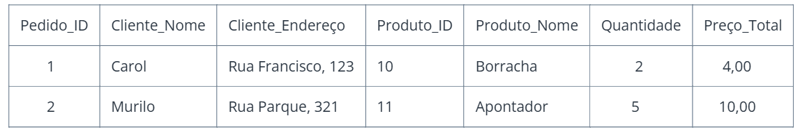

# Conceitos Teóricos

## Banco de dados Relacional
O Banco de dados relacional ou SGBD Relacional (Sistema de gerenciamento de banco de dados relacional) é um mecanismo que armazena e organiza pontos de dados, a fim de proporcionar acesso rápido, flexível e eficiente, sendo uma das formas de armazenamento mais comuns atualmente, sendo usado principalmente em cenários que exigem uma estrutura organizada e consistente. O mecanismo funciona como uma coletânea de dados, que são armazenados em uma tabela que possui colunas e linhas, lembrando muito uma estrutura de tabela de Excel. Cada tabela representa uma entidade ou relação do mundo real. As linhas representam registros individuais nessa entidade, e as colunas representam os atributos ou características dos registros. A principal característica do banco relacional é a capacidade de estabelecer relacionamentos entre tabelas por meio de chaves primárias e estrangeiras. Isso permite que os dados fiquem associados e que, futuramente, sejam consultados de maneira eficiente, garantindo a integridade relacional.
### Exemplo:
As empresas de comércio eletrônico usam bancos de dados relacionais para gerenciar e armazenar informações sobre seu catálogo de produtos (por exemplo, nome do produto, descrição, imagens, preço e estoque disponível). Manter os dados do catálogo precisos e atualizados é fundamental para garantir que os clientes tenham acesso às ofertas de produtos mais recentes e manter os níveis de estoque. Os bancos de dados relacionais permitem gerenciar diversos atributos, categorias e níveis de estoque de produtos, ao mesmo tempo que permitem a recuperação eficiente de informações do produto durante a navegação do cliente.

## Banco de dados Não Relacional 
O banco de dados não relacional é um banco de dados que possibilita a flexibilidade na hora de armazenar os dados, já que não se limita a tabelas com linhas e colunas, como o banco de dados relacional. Esse tipo de banco de dados usa um modelo de armazenamento otimizado, que é adaptável para o requisito específico de cada dado, por exemplo: possibilita que os dados sejam armazenados como chave/valor simples; documento no formato JSON (JavaScript Object Notation) ou até mesmo em forma de gráfico, composto de bordas e vértices. Esse modelo, também conhecido como NoSQL, surgiu como uma solução para casos em que há uma quantidade elevada de dados para armazenar, fator que torna complexa a estruturação em tabelas. E também permite maior flexibilidade, escalabilidade e velocidade ao armazenar e acessar dados não estruturados, já que não tem necessidade de que as databases sejam parecidas entre si. 

### Exemplo: 
Um exemplo de uso de banco de dados não relacional é em redes sociais como o Instagram. Essas plataformas lidam com grandes volumes de dados variados, como postagens com textos, imagens, vídeos, curtidas e comentários. Como essas informações têm estruturas flexíveis e mudam com frequência, bancos não relacionais como o MongoDB são mais adequados do que os relacionais. Eles permitem armazenar tudo em um único documento, oferecendo rapidez, flexibilidade e alta escalabilidade, o que garante desempenho mesmo com milhões de usuários acessando ao mesmo tempo.

## O que é Normalização? 
A normalização de banco de dados refere-se à organização de dados em tabelas para facilitar a navegação e garantir que os dados permaneçam precisos e consistentes. Por meio desse processo, administradores de banco de dados , engenheiros de dados e arquitetos de dados podem modelar e projetar uma estrutura para armazenar os dados de um aplicativo de forma que a camada de banco de dados do aplicativo funcione com a máxima eficiência.
### Qual seu objetivo? 
#### A normalização de banco de dados tem como principais objetivos:
- Eliminar a redundância de dados (evitar a repetição de informações)
- Garantir a integridade referencial (garantir que as informações relacionadas sejam consistentes e válidas)
- Facilitar a manutenção e consulta do banco de dados, pois um banco de dados normalizado é mais fácil de manter, já que as alterações em um local não afetam outras partes do sistema, além de facilitar a adição de novas funcionalidades ou a correção de erros. 
- Permitir que o sistema encontre informações de forma mais eficiente, especialmente quando o banco de dados cresce e se torna mais complexo. 
- Criar uma estrutura de dados lógica e consistente.

## Exemplo de Tabela Não Normalizada

## Normalização
## 1ª Forma Normal (1FN)

- Explicação: Primeiro, extraí as colunas que tinham a ver com o produto, para fazer uma tabela somente com as informações que dependem do cliente.
- 
- Explicação: Depois, fiz o mesmo com a parte dos Produtos, criando uma nova tabela apenas para as colunas que dependem do produto.
- 
- Explicação: Também separei somente os itens que dependem do pedido, criando uma nova tabela.
